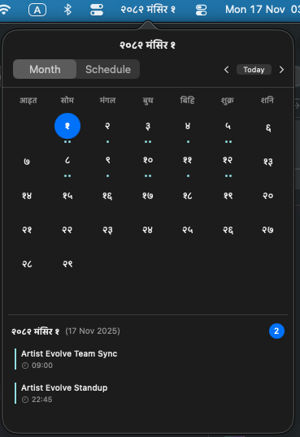
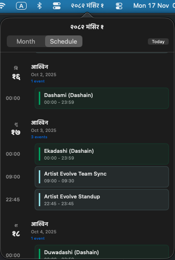

# Nepali Date Mac Menu Bar

<div align="center">


**A beautiful, minimal macOS menu bar application that displays Nepali (Bikram Sambat) dates with seamless Calendar integration.**

[Download](#download) • [Features](#features) • [Setup](#setup-guide)

</div>

---

## Screenshots

<div align="center">
<table>
<tr>
<td width="50%">

<p><em>Monthly calendar with Nepali dates and event indicators</em></p>
</td>
<td width="50%">

<p><em>Timeline view showing upcoming events</em></p>
</td>
</tr>
</table>
</div>

---

## Features

- **Dual Calendar System** - Bikram Sambat (BS) and Gregorian calendar support (2000-2100 BS)
- **Multi-Language** - English and Nepali (नेपाली) with proper numerals
- **Multiple Views** - Monthly grid and schedule timeline modes
- **Customizable Formats** - Short, long, and full date display options
- **Calendar Integration** - View macOS Calendar events in Nepali dates
- **System Integration** - Menu bar app with launch on login
- **Privacy-Focused** - All conversions local, no internet required

---

## Download

### Mac App Store (Recommended)

<a href="https://apps.apple.com/app/id6738343894">

</a>

**Price: $1.99** - Purchasing from the App Store supports the developer and ensures automatic updates.

### GitHub (Free)

**Direct Download:**

[Latest Release](https://github.com/yourusername/NepaliDaateMenuBar/releases/latest) - Download the `.dmg` file

**System Requirements:**

- macOS 12.0 (Monterey) or later
- **Universal Binary** - Works on both Apple Silicon (M1/M2/M3) and Intel Macs
- ~10 MB disk space

**Note**: The GitHub version is fully signed and notarized by Apple, so it will run securely on your Mac without any warnings.

---

## Support the Project

The app is available for **$1.99 on the Mac App Store**.

**Why pay?**

- **Support Maintenance**: Helps cover the $99/year Apple Developer Program fee.
- **Convenience**: One-click installation and automatic updates.
- **Show Love**: A small way to say thanks if you find the app useful!

**Free Forever**:
The source code and manual builds will always be free here on GitHub.

---

## Setup Guide

### Installation

1. **Download** the latest `.dmg` file from [Releases](https://github.com/yourusername/NepaliDaateMenuBar/releases/latest)

2. **Open** the downloaded DMG file

3. **Drag** the app to your Applications folder

4. **Launch** the app!

### First-Time Setup

The app will guide you through an onboarding process:

1. **Select Language** - Choose between English or Nepali (नेपाली)
2. **Choose Display Format** - Pick how dates appear in your menu bar
3. **Calendar Access** - Decide whether to integrate with macOS Calendar
4. **Launch Preferences** - Set whether to start on login

### Menu Bar Controls

Once installed, you'll see the Nepali date in your menu bar:

- **Click** the menu bar icon to open the calendar popover
- **Select** between Month or Schedule view
- **Click** any date to see events for that day
- **Navigate** months using arrow buttons or "Today" to return

### Settings

Access settings by:

1. Click the menu bar icon
2. Right-click on the app (or access via menu)
3. Adjust:
   - Language preference
   - Date format
   - Launch on login
   - Calendar permissions

## Release Process

This project uses **automated releases** with semantic versioning based on commit messages.

### Commit Message Format

Use [Conventional Commits](https://www.conventionalcommits.org/):

- `feat:` - New feature (bumps minor version: 0.0.1 → 0.1.0)
- `fix:` - Bug fix (bumps patch version: 0.0.1 → 0.0.2)
- `ci:` - Rebuild without version bump (creates v0.0.1-latest)
- `feat!:` or `BREAKING CHANGE:` - Breaking change (bumps major: 0.0.1 → 1.0.0)
- `docs:`, `chore:`, etc. - No build or release

### What Happens on Merge to Main

GitHub Actions automatically:

1. Determines version from commit messages
2. Updates `Info.plist`
3. Builds the app
4. Creates DMG installer
5. Generates changelog
6. Creates GitHub release
7. Uploads to App Store (on tag push)

See [CHANGELOG.md](CHANGELOG.md) for version history.

---

## FAQ

### Is the GitHub version safe?

Yes! The GitHub release is **signed and notarized** with an Apple Developer ID. This means Apple has checked it for malware and verified it comes from the developer.

### Can I build it myself instead?

Yes! Clone the repository and build with Xcode:

```bash
git clone https://github.com/yourusername/NepaliDaateMenuBar.git
cd NepaliDaateMenuBar
open NepaliDateMacMenuBar.xcodeproj
# Press Cmd+R to build and run
```

---

## License

Licensed under **GNU General Public License v3.0** - see [LICENSE](LICENSE) file for details.

---

## Support

- **Bug Reports**: [Open an issue](https://github.com/yourusername/NepaliDaateMenuBar/issues)
- **Feature Requests**: [Request features](https://github.com/yourusername/NepaliDaateMenuBar/issues)

---

## Acknowledgments

**[pyBSDate](https://github.com/SushilShrestha/pyBSDate)** by Sushil Shrestha - Date conversion algorithm (MIT License)

---

<div align="center">

**Made with love for the Nepali community worldwide**

[Back to Top](#nepali-date-mac-menu-bar)

</div>
